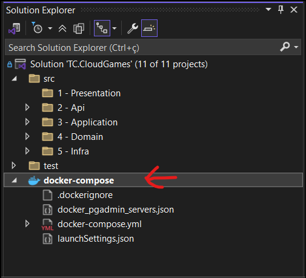
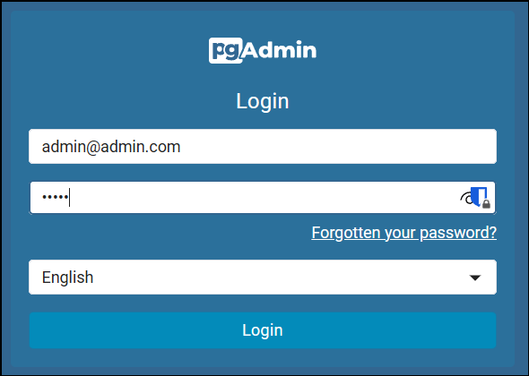
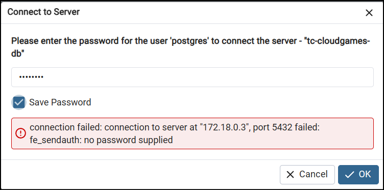

# TC.CloudGames

## Overview

TC.CloudGames is a cloud-based gaming platform built using modern software development principles, including **Clean Architecture**, **CQRS**, and **Domain-Driven Design (DDD)**. The project is structured into distinct layers (API, Application, Domain, and Infrastructure) and leverages **FastEndpoints** for high-performance API development. It also uses **Dapper** for efficient database access, ensuring optimal performance.

---

## Technology Stack

- **.NET 9** (C# 13)
- **ASP.NET Core** (Web API, FastEndpoints)
- **Entity Framework Core 9** (PostgreSQL)
- **Ardalis.Result** (for functional result handling)
- **FluentValidation** (validation)
- **Serilog** (structured logging, with sensitive data masking)
- **Bogus** (test data generation)
- **xUnit** (unit/integration testing)
- **Shouldly** (assertions)
- **Docker & Docker Compose** (container orchestration)
- **SonarAnalyzer** (static code analysis)
- **FastEndpoints.Messaging.Core** (domain events)
- **HealthChecks** (AspNetCore.HealthChecks.NpgSql, UI.Client)
- **FusionCache** (caching)
- **Serilog.Sinks.Seq** (log aggregation)
- **FakeItEasy** (mocking for tests)
- **AutoFixture** (test data auto-generation)
- **Architecture Tests** (architecture tests)

---

## Solution Structure

- **src/TC.CloudGames.Api**  
  Main ASP.NET Core Web API project.  
  - FastEndpoints for minimal, testable endpoints.
  - Swagger/OpenAPI for API documentation.
  - Serilog for logging.
  - Health checks.
  - Dockerfile and Docker Compose support.

- **src/TC.CloudGames.Application**  
  Application layer (CQRS, commands, queries, handlers, DTOs).

- **src/TC.CloudGames.Domain**  
  Domain layer (entities, value objects, domain services, validators, events).

- **src/TC.CloudGames.Infra.Data**  
  Infrastructure layer (EF Core DbContext, repositories, migrations).

- **src/TC.CloudGames.Infra.CrossCutting.Commons**  
  Shared utilities, extensions, and cross-cutting concerns.

- **src/TC.CloudGames.Infra.CrossCutting.IoC**  
  Dependency injection and service registration.

- **test/TC.CloudGames.Api.Tests**  
  API and integration tests (xUnit, FastEndpoints.Testing, FakeItEasy, AutoFixture).

- **test/TC.CloudGames.Domain.Tests**  
  Domain and value object tests (xUnit, Shouldly, Bogus).

- **test/ArchitectureTests**  
  Architecture and dependency rule tests (NetArchTest).

---

## Key Features

- **Domain-Driven Design**:  
  Rich domain model with value objects, aggregates, and domain events.

- **Builder Pattern**:  
  All aggregates and value objects support a builder pattern for flexible, validated construction (see `Game`, `User`, `GameDetails`, etc.).

- **Validation**:  
  FluentValidation for both value objects and aggregate roots, with detailed error reporting.

- **Result Pattern**:  
  All operations return `Result<T>` (Ardalis.Result), supporting success, invalid, and error states.

- **Testing**:  
  - Unit tests for all layers.
  - AutoFixture and Bogus for random data.
  - FakeItEasy for mocking.
  - Architecture tests to enforce boundaries.

- **Logging**:  
  - Serilog with environment and application enrichment.
  - Sensitive data masking (e.g., Password, Email, PhoneNumber).
  - Console and Seq sinks.

- **Health Checks**:  
  - PostgreSQL health check.

- **Docker & Cloud-Native**:  
  - Dockerfile and docker-compose for local and cloud deployment.
  - Environment variable support for configuration.

---

## Running Locally

### Prerequisites
- [.NET 9 SDK](https://dotnet.microsoft.com/download/dotnet/9.0)
- [Docker](https://www.docker.com/products/docker-desktop)

### Quick Start

1. **Clone the repository:**
```bash
# Run the following git command to clone the repository:
git clone https://github.com/your-org/TC.CloudGames.git 

# Navigate to the project directory:
cd TC.CloudGames
```

### Setup HTTPS Development Certificate

#### Linux/macOS

```bash
# Make the script executable
chmod +x ./scripts/setup-devcert.sh

# Run the setup script
./scripts/setup-devcert.sh
```

#### Windows

```powershell
# Run the setup script
.\scripts\setup-devcert.bat
```

### Running the Application


**Start services with Docker Compose:**
- Once the certificate is set up, you can run the application with Docker Compose:

```bash
docker compose up --build
```

**Or simply make docker project in Visual Studio 2022 the default startup project and hit F5**



This will start:
   - `tc.cloudgames.api` (Web API)
   - `postgres` (database)
   - `seq` (log aggregation)
   - (optionally) `pgadmin` for DB management

3. **Access the API:**
   - Swagger UI: [http://localhost:55556/swagger](http://localhost:55556/swagger)
   - Health checks: [http://localhost:55556/health](http://localhost:55556/health)
   - Seq logs: [http://localhost:8082](http://localhost:8082)

4. **Seed Data:**
   - The API will seed users and games on startup if the database is empty.

The mapped ports can be seen using:

```bash
docker port TC.CloudGames.Api
docker port TC.CloudGames.Seq
docker port TC.CloudGames.PgAdmin4
```

The application will also create a PostgreSQL database container and run migrations automatically.

To access the database, you can use a PostgreSQL client like pgAdmin or DBeaver.
- pgAdmin: [http://localhost:15432/](http://localhost:15432/)
```bash
# Default credentials for pgAdmin:
# Username:
    - admin@admin.com
# Password: 
    - admin
```


### Database Login on localhost server
- After logging in to pgAdmin, you can access the database using the following credentials:



```bash
# Default credentials for PostgreSQL:
# Username:
    - postgres
# Password:
    - postgres
```

### Database Structure

The application will create a database named `tc_cloud_games` with the following tables:
- `Users`
- `Games`


---
## Testing

- **Unit Tests:**

```bash
# Run unit tests for solution in the root folder of the application
dotnet test TC.CloudGames.sln --logger "console;verbosity=minimal"
```

- All test projects target .NET 9.
  - Coverage is collected via `coverlet.collector`.
  - Architecture rules are enforced via `ArchitectureTests`.

- **Test Libraries Used:**
  - xUnit
  - Shouldly
  - FakeItEasy
  - AutoFixture
  - Bogus

---

### Notes

- The certificate is automatically mapped into the Docker container using the volumes defined in docker-compose.override.yml
- The certificate password is set in both the scripts and the docker-compose.override.yml file
- If you change the password in the scripts, also update it in docker-compose.override.yml

## Features

### User Management
- **Add Users**: Create new users with roles such as `Admin` or `User`.
- **Login**: Authenticate users and manage sessions.
- **List Users**: Retrieve a paginated list of users with filtering and sorting options.

### Game Management
- **Create Games**: Add new games to the platform with detailed metadata, including genre, platform, price, and system requirements.
- **List Games**: Retrieve a paginated list of games with filtering and sorting options.
- **Get Game Details**: Fetch detailed information about a specific game.

## Tech Stack

### Architecture
- **Clean Architecture**: Separation of concerns into API, Application, Domain, and Infrastructure layers.
- **CQRS**: Command Query Responsibility Segregation for clear separation of read and write operations.
- **DDD**: Domain-Driven Design principles for modeling the core business logic.

### Frameworks and Libraries
- **FastEndpoints**: High-performance API framework for building RESTful endpoints.
- **Dapper**: Lightweight ORM for efficient database access.
- **Ardalis.Result**: Standardized result handling for commands and queries.

### Infrastructure
- **Docker**: Containerized deployment with a `docker-compose` setup.
- **PostgreSQL**: Relational database for storing application data.

## Project Structure

- **API Layer**: Contains the FastEndpoints-based REST API.
  - Example: `GetGameEndpoint`, `GetUserListEndpoint`.
- **Application Layer**: Implements business logic and CQRS handlers.
  - Example: `GetGameListQueryHandler`, `CreateGameCommandHandler`.
- **Domain Layer**: Contains core domain models and business rules.
  - Example: `Game`, `User`.
- **Infrastructure Layer**: Handles database access and external integrations.
  - Example: `ISqlConnectionFactory` for managing database connections.

## API Endpoints

### User Endpoints
1. **Add User**: `POST /users`
   - Request: 
     {
   "firstName": "John",
   "lastName": "Doe",
   "email": "john.doe@example.com",
   "role": "User"
 }

    - Response: `201 Created`
2. **Login**: `POST /users/login`
   - Request: 
     {
   "email": "john.doe@example.com",
   "password": "password123"
 }

    - Response: 
     
     {
   "token": "jwt-token"
 }

 3. **List Users**: `GET /users`
   - Query Parameters: `?filter=John&pageNumber=1&pageSize=10&sortBy=FirstName&sortDirection=ASC`
   - Response: 
      [
   {
     "id": "guid",
     "firstName": "John",
     "lastName": "Doe",
     "email": "john.doe@example.com",
     "role": "User"
   }
 ]


### Game Endpoints
1. **Create Game**: `POST /games`
   - Request: 
 {
   "name": "Game Name",
   "releaseDate": "2025-01-01",
   "price": 59.99,
   "genre": "Action",
   "platform": ["Windows", "Xbox"]
 }

        - Response: `201 Created`
2. **List Games**: `GET /games`
   - Query Parameters: `?filter=Action&pageNumber=1&pageSize=10&sortBy=Name&sortDirection=ASC`
   - Response: 
     

   [
   {
     "id": "guid",
     "name": "Game Name",
     "releaseDate": "2025-01-01",
     "price": 59.99,
     "rating": 4.5
   }
 ]

  3. **Get Game Details**: `GET /games/{id}`
   - Response: 
       {
   "id": "guid",
   "name": "Game Name",
   "releaseDate": "2025-01-01",
   "price": 59.99,
   "genre": "Action",
   "platform": ["Windows", "Xbox"]
 }

 ## Highlights

### Dapper for Performance
- **Why Dapper?**
  - Lightweight and fast compared to traditional ORMs.
  - Direct SQL execution for better control and performance.
- **Usage in the Project**:
  - Used in query handlers like `GetGameListQueryHandler` and `GetUserListQueryHandler` for efficient data retrieval.

### Clean Architecture Benefits
- Clear separation of concerns.
- Easy to test and maintain.
- Scalable for future feature additions.

