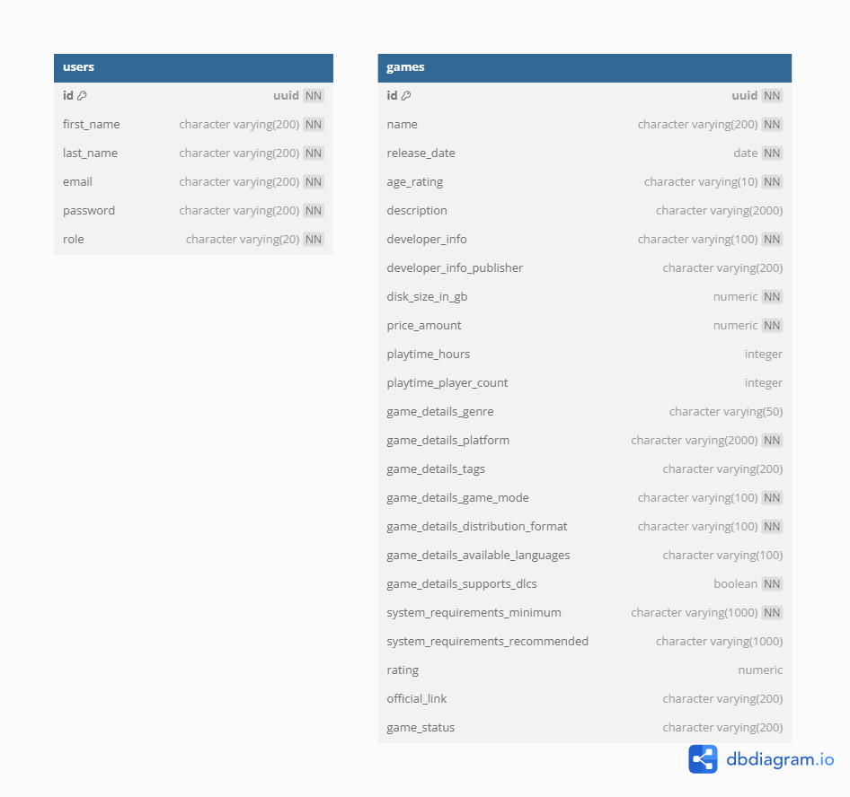

# 🎮 TC.CloudGames

**TC.CloudGames** is a cloud-native backend application developed using .NET 9, designed to simulate a scalable digital game sales and management platform. This project was created as part of the FIAP Tech Challenge – Phase 2, focusing on **cloud infrastructure**, **CI/CD automation**, and **production-ready monitoring**.

---

## 📌 Project Overview

TC.CloudGames provides a robust, **scalable backend system** deployed on **Azure Cloud** that supports:

- **User Authentication**: Secure login and registration with JWT tokens
- **Game Management**: CRUD operations for digital games with advanced filtering
- **Cloud Infrastructure**: Azure Container Apps with auto-scaling capabilities
- **Real-time Monitoring**: Application metrics and observability with Grafana
- **Automated CI/CD**: Multi-stage deployment pipeline with approval gates

### 🏗️ **Phase 2 Enhancements**

This phase introduces **production-ready cloud infrastructure** and **DevOps best practices**:

#### ☁️ **Azure Cloud Infrastructure**
- **Azure Container Apps**: Serverless container platform with auto-scaling
- **Azure Container Registry**: Private Docker image repository
- **Azure Key Vault**: Secure secrets and configuration management
- **Azure PostgreSQL**: Managed database with automatic backups
- **Azure Cache for Redis**: High-performance distributed caching
- **Infrastructure as Code**: Terraform with remote state management

#### 🚀 **Advanced CI/CD Pipeline**
- **Multi-stage Workflow**: Separate CI/CD stages with approval gates
- **Environment Isolation**: Development environments with controlled deployments
- **Automated Testing**: Unit tests, security scans, and vulnerability assessments
- **Blue-Green Deployments**: Zero-downtime application updates
- **Infrastructure Deployment**: Automated provisioning via Terraform Cloud

#### 📊 **Production Monitoring**
- **Grafana Dashboard**: Real-time metrics and application insights
- **Prometheus Integration**: Custom metrics collection and alerting
- **Health Checks**: Automated application health monitoring
- **Performance Metrics**: Database, cache, and application performance tracking

---

## 📚 Documentation & Resources

   - **Phase 2 Architecture**: [Azure Infrastructure Diagrams](doc/fase_02/)
   - **Event Storming**: [Miro Event Storming Diagram](https://miro.com/app/board/uXjVI4H0GgA=/)
   - **Project Documentation**: [Notion Workspace](https://checkered-cod-bac.notion.site/Tech-Challenge-Net-1dfc8c4bf938806da273ca6a401f147d)
   - **API Testing**: [Postman Collection](doc/fase_01/TC.CloudGaming.postman_collection.json)
   - **Phase 1 Demo**: [YouTube Video](https://www.youtube.com/watch?v=9zyK9rb1lTs)

---

## 🛠️ Technology Stack

### **Core Application**
- **.NET 9**: High-performance web framework with minimal APIs
- **ASP.NET Core**: Web API with FastEndpoints for optimal performance
- **Entity Framework Core**: Advanced ORM with PostgreSQL integration
- **Serilog**: Structured logging with sensitive data masking

### **Cloud Infrastructure (Azure)**
- **Azure Container Apps**: Serverless container hosting with auto-scaling
- **Azure Container Registry**: Private Docker image repository
- **Azure PostgreSQL Flexible Server**: Managed database with high availability
- **Azure Cache for Redis**: Distributed caching for performance optimization
- **Azure Key Vault**: Centralized secrets and configuration management

### **DevOps & Monitoring**
- **GitHub Actions**: Advanced CI/CD with multi-stage workflows
- **Terraform**: Infrastructure as Code with Terraform Cloud
- **Docker**: Optimized containerization for cloud deployment
- **Grafana**: Real-time monitoring and alerting dashboards
- **Prometheus**: Metrics collection and observability

---

## 🚀 Getting Started

### **Local Development**

#### Prerequisites
- [.NET 9 SDK](https://dotnet.microsoft.com/en-us/download/dotnet/9.0)
- [Docker Desktop](https://www.docker.com/get-started)
- [Docker Compose](https://docs.docker.com/compose/install/)

#### Quick Start
1. **Clone the repository**:
   ```bash
   git clone https://github.com/rdpresser/tc-cloud-games.git
   cd tc-cloud-games
   ```

2. **Setup HTTPS Development Certificate**:
   ```bash
   # Linux/macOS
   chmod +x ./scripts/setup-devcert.sh && ./scripts/setup-devcert.sh
   
   # Windows
   .\scripts\setup-devcert.bat
   ```

3. **Start the application**:
   ```bash
   docker-compose up --build
   ```
   
   *Or set `docker-compose` as the startup project in Visual Studio 2022 and press F5*

4. **Access the application**:
   - **API Documentation**: [http://localhost:55556/swagger](http://localhost:55556/swagger)
   - **Health Monitoring**: [http://localhost:55556/health](http://localhost:55556/health)
   - **Structured Logs**: [http://localhost:8082/](http://localhost:8082/) (Seq)
   - **Code Quality**: [http://localhost:9000/](http://localhost:9000/) (SonarQube)
   - **Database Admin**: [http://localhost:15432/](http://localhost:15432/) (pgAdmin)

#### **Default Credentials**
```bash
# API Authentication
Admin User: admin@admin.com / Admin@123
Regular User: user@user.com / User@123

# pgAdmin Access
Username: admin@admin.com / Password: admin

# PostgreSQL Database
Username: postgres / Password: postgres
```

#### **Database Schema**
The application creates a `tc_cloud_games` database with:
- **Users**: Authentication and profile management
- **Games**: Game catalog and metadata
- 

### **Cloud Deployment**

The application is automatically deployed to **Azure Cloud** using **GitHub Actions CI/CD pipeline**:

#### 🔄 **Automated Deployment Process**
1. **Continuous Integration**: Triggered on every commit/PR
   - Code compilation and unit testing
   - Security vulnerability scanning
   - Code quality analysis

2. **Infrastructure Provisioning**: Automated via Terraform
   - Azure Container Apps environment setup
   - PostgreSQL database provisioning
   - Redis cache configuration
   - Key Vault secrets management

3. **Continuous Deployment**: Triggered on master branch merge
   - Docker image build and push to Azure Container Registry
   - Zero-downtime deployment to Azure Container Apps
   - Database health checks and application monitoring

#### 🌐 **Production Environment**
- **Live Application**: Deployed on Azure Container Apps with auto-scaling
- **Monitoring Dashboard**: Real-time metrics via Grafana
- **High Availability**: Multi-region deployment with load balancing

---

## 🧪 Testing & Quality Assurance

### **Automated Testing**
```bash
# Run complete test suite
dotnet test TC.CloudGames.sln

# Run with coverage reports
./scripts/code_coverage.sh  # Linux/macOS
.\scripts\code_coverage.bat  # Windows
```

### **Code Quality Analysis**
```bash
# SonarQube analysis
./scripts/code_analysis.bat
```

---

## 📊 Monitoring & Observability

### **Application Metrics**
- **Health Endpoints**: Built-in health checks for all dependencies
- **Performance Counters**: Custom metrics for business operations
- **Distributed Tracing**: End-to-end request tracking
- **Error Tracking**: Centralized exception monitoring

### **Infrastructure Monitoring**
- **Resource Utilization**: CPU, memory, and network metrics
- **Database Performance**: Query performance and connection pooling
- **Cache Efficiency**: Redis hit/miss ratios and performance
- **Auto-scaling Events**: Container scaling decisions and triggers

---

## 🏗️ Architecture Overview

### **Application Architecture**
```
┌────────────────────┐    ┌──────────────────┐    ┌─────────────────┐
│   GitHub Actions   │    │  Azure Container │    │   Azure Cache   │
│     CI/CD Pipeline │────│      Apps        │────│   for Redis     │
└────────────────────┘    └──────────────────┘    └─────────────────┘
                                   │
                                   ▼
┌─────────────────┐    ┌─────────────────┐    ┌─────────────────┐
│  Azure Key Vault│    │   TC.CloudGames │    │ Azure PostgreSQL│
│    (Secrets)    │────│   Application   │────│   Database      │
└─────────────────┘    └─────────────────┘    └─────────────────┘
                                │
                                ▼
                       ┌────────────────────┐
                       │ Grafana/Prometheus │
                       │   Monitoring       │
                       └────────────────────┘
```

### **CI/CD Pipeline Flow**
1. **Code Commit** → GitHub Actions triggered
2. **Build & Test** → .NET compilation, unit tests, security scans
3. **Infrastructure** → Terraform provisions Azure resources
4. **Deploy** → Docker image built and deployed to Azure Container Apps
5. **Monitor** → Health checks and performance monitoring activated

---

## 🔐 Security Features

- **Azure Key Vault Integration**: Centralized secrets management
- **JWT Authentication**: Secure token-based authentication
- **Environment Isolation**: Separate development/production environments
- **Network Security**: Private endpoints and network policies
- **Vulnerability Scanning**: Automated dependency and container scanning
- **Secrets Rotation**: Automated credential rotation capabilities

---

## � Scalability & Performance

- **Auto-scaling**: Horizontal pod autoscaling based on CPU/memory metrics
- **Caching Strategy**: Multi-layer caching with Redis
- **Database Optimization**: Connection pooling and query optimization
- **CDN Integration**: Static content delivery optimization
- **Load Balancing**: Automatic traffic distribution across instances

---

## 📂 Project Structure

```
tc-cloud-games/
├── .github/workflows/     # CI/CD pipeline definitions
├── infra/terraform/       # Infrastructure as Code
├── src/                   # Application source code
├── test/                  # Comprehensive test suite
├── scripts/               # Development and deployment scripts
├── doc/                   # Project documentation
├── docker-compose.yml     # Local development environment
└── README.md              # This file
```

---

## 📄 Key Features

### **User Management** 
- **Authentication**: JWT-based secure login system
- **Role-Based Access**: Admin and User role management
- **User Registration**: Account creation with validation
- **Profile Management**: User profile updates and management

### **Game Management**
- **CRUD Operations**: Complete game lifecycle management
- **Advanced Filtering**: Search by genre, platform, price range
- **Metadata Management**: Rich game information and system requirements
- **Inventory Tracking**: Game availability and stock management

### **Cloud Infrastructure**
- **Serverless Deployment**: Azure Container Apps with zero-config scaling
- **Managed Database**: Azure PostgreSQL with automatic backups
- **Distributed Caching**: Redis for high-performance data access
- **Secrets Management**: Azure Key Vault for secure configuration

### **DevOps Excellence**
- **Infrastructure as Code**: Terraform for reproducible deployments
- **Multi-Environment Support**: Isolated development and production environments
- **Automated Monitoring**: Comprehensive observability and alerting
- **Zero-Downtime Deployments**: Blue-green deployment strategy

---

## 🚧 Future Enhancements

### **Planned Features (Phase 3)**
- **Microservices Architecture**: Service decomposition for enhanced scalability
- **API Gateway**: Centralized API management and rate limiting

### **Performance Optimizations**
- **Event-Driven Architecture**: Asynchronous processing with Service Bus

---

## 📧 Contact & Support

- **Project Team**: FIAP Tech Challenge Group
- **Repository**: [tc-cloud-games](https://github.com/rdpresser/tc-cloud-games)
- **Documentation**: [Notion Workspace](https://checkered-cod-bac.notion.site/Tech-Challenge-Net-1dfc8c4bf938806da273ca6a401f147d)
- **Issues**: [GitHub Issues](https://github.com/rdpresser/tc-cloud-games/issues)

---

*Built with ❤️ using .NET 9, Azure Cloud, and modern DevOps practices*
